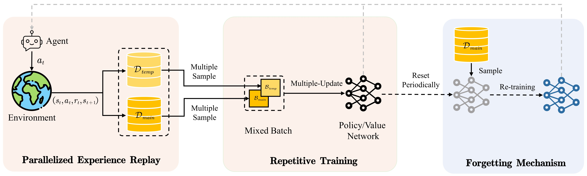

<<<<<<< HEAD
# HI-FER
Human-Inspired Frequent Experience Replay
=======
<<<<<<< HEAD
# HI-FER
Human-Inspired Frequent Experience Replay
=======
## Integrating Human Learning and Reinforcement Learning: A Novel Approach to Agent Training

This repository is the official implementation of **HI-FER** for the DeepMind control experiments.

### Abstract

Off-policy Reinforcement Learning (RL) algorithms are known for improving sample efficiency by employing the prior experiences in an experience replay memory. However, most existing off-policy RL algorithms update policies by a single sampling, which fails to fully exploit the data in replay memory. In this paper, a novel algorithm that mimics human learning process is proposed for training RL agents, which is called HI-FER (Human-Inspired Frequent Experience Replay). A parallelized experience replay structure is proposed to improve the generalization ability of RL algorithms by imitating the function of human brain’s compositional computation to derive qualitatively new knowledge. We increase the update frequency of model parameters to enhance the sample efficiency. And to prevent overfitting triggered by multiple updating on limited experiences, a periodic network reset strategy and dynamically memory updating is leveraged by imitating the natural forgetting mechanism of human. Extensive comparison experiments and ablation studies are performed on benchmark environments to evaluate the proposed method. The empirical results demonstrate that HI-FER outperforms the baselines in terms of sample efficiency on state-based (14% improvements) and image-based (51% improvements) tasks from DMControl.

### Overview of HI-FER



In the Parallelized Experience Replay part (**left**), all experiences are stored in two separate replay buffers. Simultaneously sampling from both `D_main` and `D_temp` improves the diversity and quality of training data for enhancing the opportunity of deriving new knowledge by compositional computation. In the Repetitive Training part (**Middle**), a multi-sampling strategy is utilized to increase the update frequency of parameters by multiple sampling from both `D_main` and `D_temp`, and repetitively updating network parameters. In the Forgetting mechanism part (**Right**), we reset the network parameters periodically to overcome the knowledge bias triggered by repetitive training. To address short-term performance collapses caused by resetting, a re-training will be performed on a fixed experience replay memory `D_main`. 

### Instructions

#### Image-based tasks

```
# CURL-HIFER
python train.py --domain_name walker --task_name run

# DrQ-HIFER
python train.py task=walker_stand seed=1
```

#### State-based tasks

```
# SAC-HIFER
python train.py env=walker_run seed=1 experiment=defaule
```

In addition to the above commands, you can also execute 'execute.py' with 'shell.txt' for batch training.

```
python execute.py
```

### Acknowledgements

We thank the  [SAC](https://github.com/denisyarats/pytorch_sac), [CURL](https://mishalaskin.github.io/curl/) and [DrQ-v2](https://github.com/facebookresearch/drqv2) authors for their implementation.

### License

The majority of three baselines is licensed under the MIT license, however portions of the project are available under separate license terms: DeepMind is licensed under the Apache 2.0 license.
>>>>>>> 95c574e (first commit)
>>>>>>> 06faaa5 (first commit)
